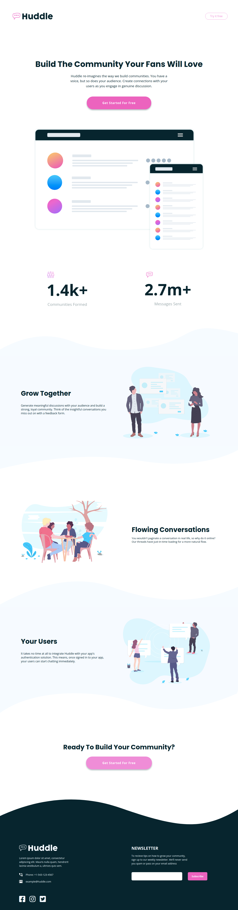

# Frontend Mentor - Huddle landing page with curved sections solution

## Table of contents

- [Overview](#overview)
  - [The challenge](#the-challenge)
  - [Screenshot](#screenshot)
  - [Links](#links)
- [My process](#my-process)
  - [Built with](#built-with)
  - [What I learned](#what-i-learned)
  - [Continued development](#continued-development)
  - [Useful resources](#useful-resources)
- [Author](#author)

## Overview

### The challenge

Users should be able to:

- View the optimal layout for the site depending on their device's screen size
- See hover states for all interactive elements on the page

### Screenshot

### Links

- Solution URL: [Github Repo.](https://github.com/skyv26/huddle-landing-page-with-curved-section)
- Live Site URL: [Netlfiy](https://myhuddlecurved.netlify.app/)

## My process

### Built with

- Semantic HTML5 markup
- CSS custom properties
- Flexbox
- CSS Grid
- Mobile-first workflow
- [React](https://reactjs.org/) - JS library
- [Styled Components](https://styled-components.com/) - For styles

### What I learned

I learned alot from this project and I found so many things interesting and helpful which I will
apply on next project. I used styled-components for first time.

### Continued development

ReactJS, NextJS, Django

## Available Scripts

In the project directory, you can run:

### `yarn start`

Runs the app in the development mode.\
Open [http://localhost:3000](http://localhost:3000) to view it in the browser.

The page will reload if you make edits.\
You will also see any lint errors in the console.

### `yarn build`

Builds the app for production to the `build` folder.\
It correctly bundles React in production mode and optimizes the build for the best performance.

## Author

- LinkedIn - [@devaakash](https://www.linkedin.com/in/devaakash/)
- Frontend Mentor - [@skyv26](https://www.frontendmentor.io/profile/skyv26)
- Twitter - [@vrma_aakash](https://www.twitter.com/vrma_aakash)
